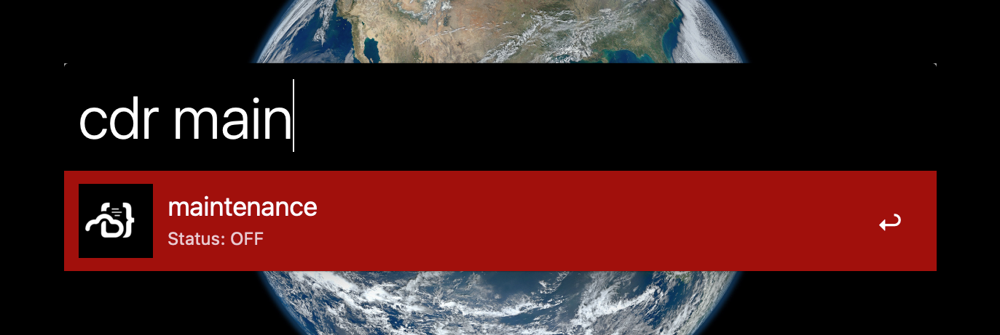

# alfred-coder

> Alfred workflow to start/stop workspaces on Coder



## Installation

1. Download [zip](https://github.com/zpthree/alfred-coder/archive/refs/heads/master.zip)
2. Unzip
3. Double-click alfred-coder.alfredworkflow and import to Alfred
4. Right-click on the workflow and select "Open in Terminal"
5. Install dependencies by running npm install
6. Copy example.env to .env and assign values to all the variables

```
cp example.env .env
nano .env
```

## Requirements

You will need to have the [coder cli](https://github.com/coder/coder-cli) installed and configured. We're also going to be using the Coder API to get workspaces, so you will also need to create a Coder API key by running the following command in your terminal:

```
coder tokens create api_key
```

Note: We are using the API to get the workspaces, rather than the coder cli, because the API is much faster.

## Usage

Search for a workspace with the `coder` or `cdr` keywords. Select the workspace to start/stop it.

There are also currently four tasks that you can use in addition to toggling the workspace.

Some commands will open urls in your default browser. On the first line of the `Run Script` action you can set the browser to whatever browser you want to use. I have it set to `Firefox Developer Edition`.

### Commands

- `cdr workspace` - display the given workspaces with any commands that may be available. Certain commands will only be available if the workspace is running.

- `cdr stop workspace` - stop the given workspace

- `cdr start workspace` - start the given workspace

- `cdr view workspace` - open the frontend of given workspace in the browser. You can specify the base url with the `APP_USER` and `BASE_URL` environment variables.

- `cdr code workspace` - open the code for the given workspace in the browser in your editor of choice. You can specify the editor with the `EDITOR` environment variable.

- `cdr term workspace` - open the terminal for the given workspace in the browser.

- `cdr stop:all` - stop all workspaces

```
browser="Firefox Developer Edition"
```

## References

- Coder Workspaces API - https://apidocs.coder.com/#operations-tag-Workspaces
- Coder CLI - https://github.com/coder/coder-cli
